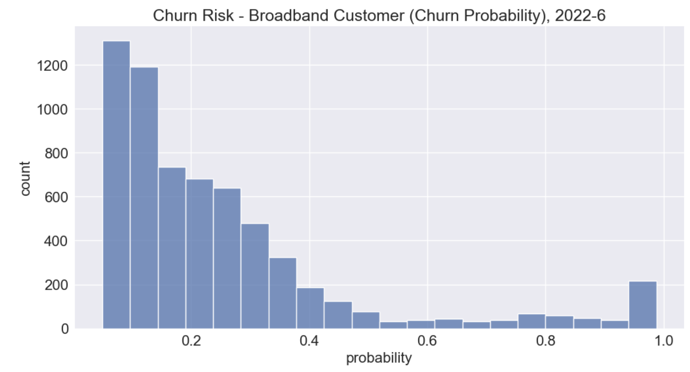
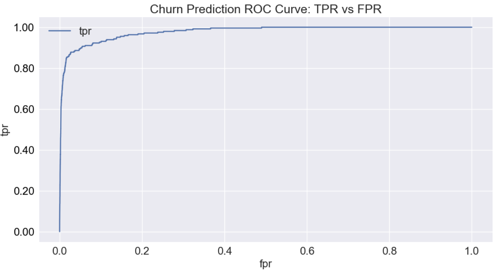
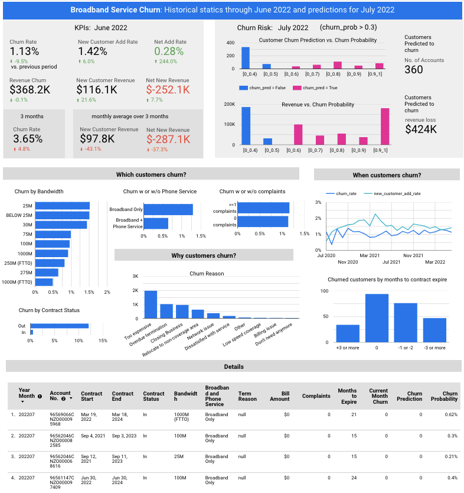

# 
Churn Analytics

## Broadband Service Customer Churn Risk Predictive Model
[Jupyter Notebook for analyzing and developing a churn risk predictive model](https://github.com/Aljgutier/churn_analytics/blob/main/churn_prediction_broadband.ipynb) for a Broadband Service. A typical use case for a churn risk score is to support of customer targeting to drive actions for churn reduction. The data is from [Sireesha Pulipati Data Storytelling with Google Looker Studio, ch 10, available on Github](https://github.com/PacktPublishing/Data-Storytelling-with-Google-Data-Studio/blob/master/customer_churn_data.zip). The data includes 510124 rows, representing customer data from 27,605 customers, 24 months (2 years), In summary, the notebook does the following:
* Loads, cleans and transforms data in preparation for ML Feature Engineering
* Feature analysis and Feature Engineering, including using hist plots, correlations, and bar plots. 
* Variable Deskew, Standardization, oversampling with SMOTE due to the (imbalanced dataset), and feature importance
* ML Training with an evaluation of 3 models - RF, XGB, and lightGBM. The final model chosen is lightGBM due to its excellent predictive and superior computational performance.
* Excellent predictive performance is obtained and is exemplified by an AUC score of 91.7%. Without the use of SMOTE, the AUC obtained was at about 75%. Recall and Selectivity are as follows: sensitivity_recall_tpr = 0.854, specicifity_selectivity_tnr = 0.98
* Churn probabilities are predicted for the last month of service corresponding to 2022, month 6.

<figure>
 
 <figcaption>
Figure 1. Churn Risk (probability)
</figcaption>
 </figure>

<figure>
 
 <figcaption>
Figure 2. Broadband Churn Prediction ROC Curve
</figcaption>
 </figure>

# Broadband Service Churn BI

The broadband service churn BI dashboard provides the VP/Director of marketing and staff actionable intelligence for identifying the reasons for churn and a churn risk corresponding to customers likely to churn. This information provides the basis for correcting issues that cause churn and targeting customers for retention. 

The dashboard includes churn KPIs such as churn rate, net add rate, revenue churn, and multiple-month churn rate. Churn rate is broken out by service features, such as with or without phone service, and by variables, such as customer complaints and contract status. The proportion of customers defecting due to each term reason is also displayed.

Cross-filtering enables the user to click on a bar, for example, customers with phone service, and see the projected revenue churn corresponding to customers with this feature. Additionally, the detailed table listing is filtered to show the corresponding accounts.

The data source is the same as for the above notebook. The corresponding input data is loaded to Big Query. The Looker Studio BI dashboard issues direct queries to Big Query and renders the BI visualizations.

<figure>
 
 <figcaption>
Figure 3. Broadband Service Churn Dashboard
</figcaption>
 </figure>